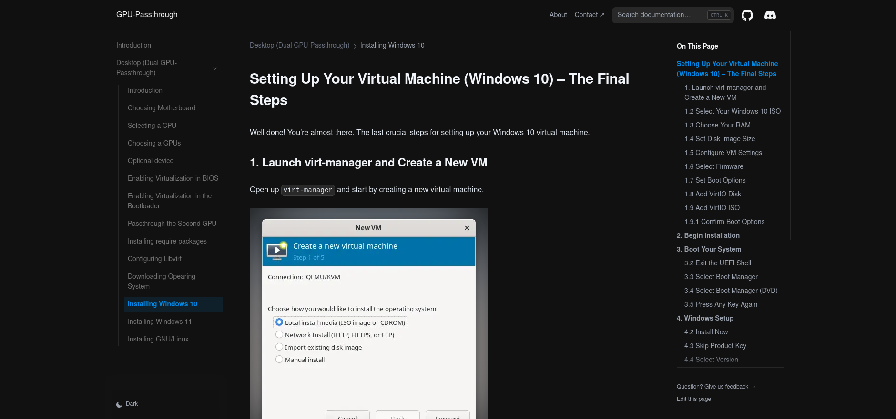

# GPU-Passthrough Documentation

This document contains comprehensive information about GPU-Passthrough. It was created using [Nextra](https://nextra.site).

## Local Development

First, run `pnpm i` to install the dependencies.

Then, run `pnpm dev` to start the development server and visit localhost:3000.

## License

This project is licensed under the MIT License.
