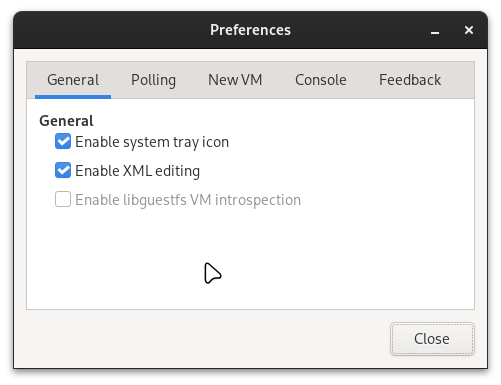
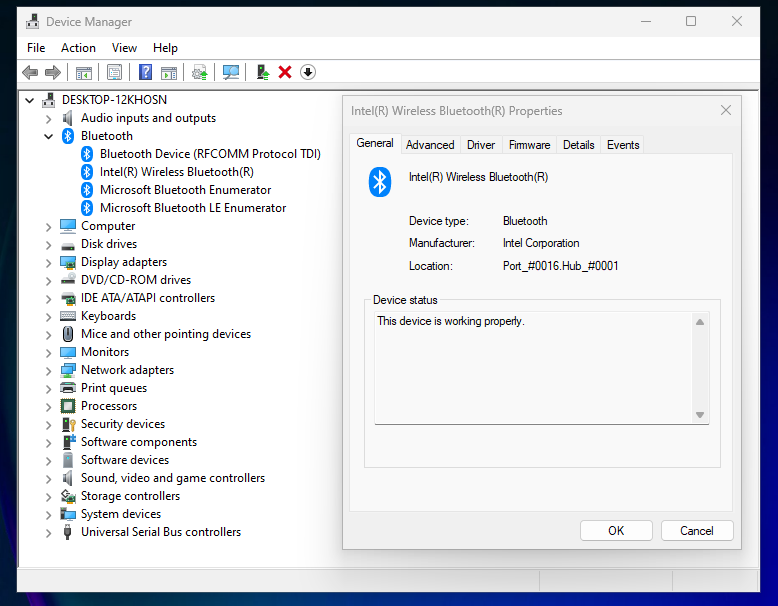

# Intel AX211 Bluetooth Error Code 10

This section will guide you through the steps to resolve the Bluetooth error code 10 when using an Intel AX211 Bluetooth device in a Windows virtual machine. The error code 10 is a issue when using bluetooth devices in a virtual machine. This guide will help you to resolve this issue.


# What's the problem?

I quote [Redditor](https://www.reddit.com/r/VFIO/comments/wbsqy1/how_to_fix_onboard_intel_bluetooth_error_code_10/) that said:

The issue stems from a change in libvirt. Libvirt is responsible for parsing all your VM's XML and turning it into a QEMU command. Somewhere between the time libvirt version 6.6 and version 6.9 were released, QEMU slightly changed the way USB devices are handled, and obviously libvirt followed suit. As a result, some USB passthrough configurations, such as the MacOS one in the thread, as well as the onboard bluetooth for windows suffered errors.

Let's fix the Bluetooth error code 10 issue in Virt-Manager, shutdown your system first. we'll need to modify the XML configuration of your virtual machine.

## XML Modfity Method

There's two methods to modify the XML configuration of your virtual machine. You can use the command line method or the GUI method. I will recommend the GUI method of this case since you might be need to verify the XML syntax. and the virt-manger has the built-in code beautifier. which can be apply with code beautifier. You dont need to worry about the XML syntax. This built-in feature in Virt-Manager will handle it for you.

### GUI Method

If you want to use GUI method, you have to enable the XML editor in Virt-Manager. To do this, follow the steps below:

1. Open Virt-Manager and select your virtual machine.
2. Head to the `Edit` menu and select `Preferences`.
3. In the `Preferences` window, select the `General` tab.
4. Check the box next to `Enable XML editing`.



5. Add the following section to the `<domain>` section and bottom of the devices part:

  ```xml
  <domain xmlns:qemu="http://libvirt.org/schemas/domain/qemu/1.0" type="kvm">  
    <devices>    
     ..    
    </devices>    
    <qemu:capabilities>    
      <qemu:del capability="usb-host.hostdevice"/>    
    </qemu:capabilities>    
  </domain>
   ```

6. **Apply the Changes:**

   After adding the XML code, click on the `Apply` button to save the changes. Check the XML syntax and the code are not apply correctly. If not, the code beautifier will remove the code that you added.


5. **Power on Your System:**

  After ensuring that the XML code has been applied, you can now power on your system. Your Bluetooth system should be working without encountering the error code 10. As shown in the image below:




### Command Line Method

Command line Method is the alternative method to modify the XML configuration of your virtual machine. You can use the `virsh` command to edit the XML configuration of your virtual machine.

1. Identify your virtual machine first. You can do this by running the following command:

   ```shell
   sudo virsh list --all
   ```
3. **Edit Your Config XML:**

   Edit your XML configuration using your preferred text editor. For Vim:

   ```shell
   sudo EDITOR=vim virsh edit [Your-VM-Name]
   ```


   Add the following section to the `<domain>` section and bottom of the devices part:

   ```xml
   <domain xmlns:qemu="http://libvirt.org/schemas/domain/qemu/1.0" type="kvm">  
     <devices>    
     ...    
     </devices>    
     <qemu:capabilities>    
       <qemu:del capability="usb-host.hostdevice"/>    
     </qemu:capabilities>    
   </domain>
   ```

4. **Save and Exit:**

    After adding the XML code, save and exit the text editor. The changes will be applied to your virtual machine. You can check the code on that XML section. If correct, the code will be apply correctly. if not the code will be removed automatically.

## References

- [How to fix onboard Intel Bluetooth Error Code 10 on Windows guest](https://www.reddit.com/r/VFIO/comments/wbsqy1/how_to_fix_onboard_intel_bluetooth_error_code_10/)
- [Bluetooth device passthrough: Intel Bluetooth Driver Errors Need Help!](https://www.reddit.com/r/VFIO/comments/sdctt2/bluetooth_device_passthrough_intel_bluetooth/)
- [Intel Bluetooth code 10 error Windows 10](https://www.reddit.com/r/VFIO/comments/nej8me/intel_bluetooth_code_10_error_windows_10/)
- [Cannot find 'vi' in path](https://www.reddit.com/r/VFIO/comments/re18ew/cannot_find_vi_in_path/)
- [8 Linux virsh subcommands for managing VMs on the command line](https://www.redhat.com/sysadmin/virsh-subcommands)
