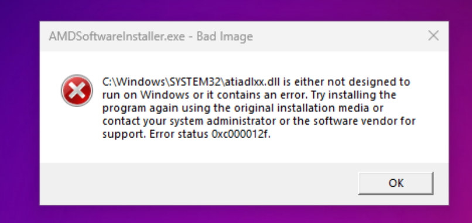
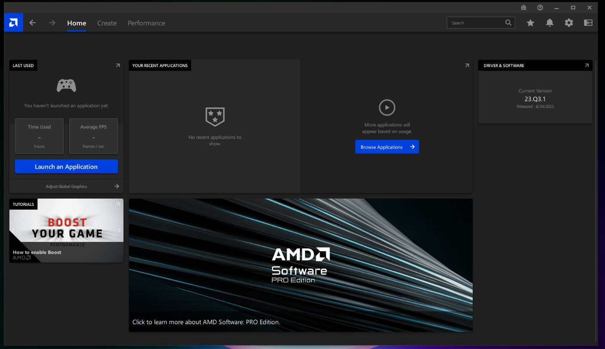
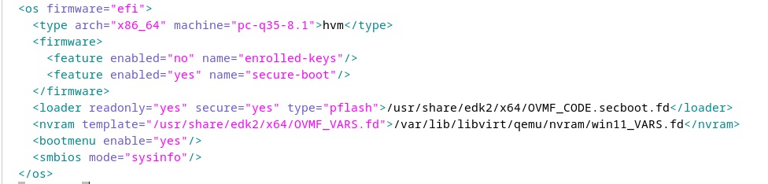
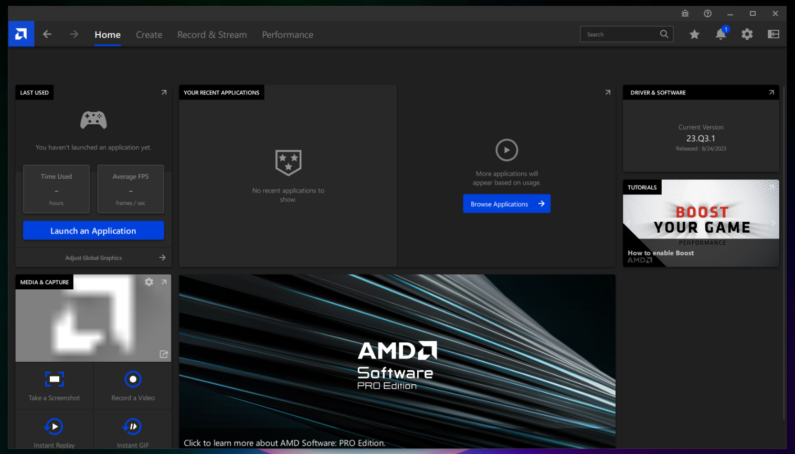

# Fake Motherboard Information

When using a virtual machine, the system may display error messages related to missing drivers. These errors can be attributed to the absence of motherboard information in the system. The lack of this information can lead to driver-related issues, such as the system not recognizing the GPU or CPU. Therefore, it's essential to add fake motherboard information to the system to resolve these errors. and ensure that the drivers function correctly.

Moreover, it's essential to note that even if your GPU is successfully passed through, your VM can only access the GPU and CPU on your system since there is no motherboard present. To resolve this driver-related issue, the solution involves adding fake motherboard information to the system.

After applying the motherboard configuration outlined below and reinstalling the drivers, the system should no longer display any error messages.

>Error message: ... is either not designed to run Windows or contains an error ...



### Why Not Ignore the Error?

While you can still install the drivers without addressing the error, doing so may lead to a lack of certain features. Typically, let use AMD drivers as an example. The Full installation of AMD should include the recording and overlay features. However, if you ignore the error, these features will not be available.



## Prerequisites

Before proceeding, make sure you have enable XML editing by (`virt-manger` -> `Edit` -> `Enable XML editing`)


### Steps to Add Fake Motherboard Information

1. **Power Down Your System:**

   Before editing the XML configuration, ensure that your guest-system is powered off.

2. **Open Virtual Machine XML Configuration:**
   
   Open the XML configuration of your virtual machine. You can do this by opening Virt-manager, and then navigating to the `Show virtual hardware details` option. And so, you can directly edit the XML by opening the virtual machine's configuration file.

3. **Add Sysinfo Section:**

   At the top of the `<os>` section, add the following code to enable the System Information (Sysinfo) section:

   ```xml
   <os>
       <smbios mode="sysinfo"/>
   </os>
   ```

   After adding the code, it will look like this:

   

4. **Insert Fake Motherboard Information:**

   At the top of the `<os>` section, insert the Sysinfo section with fake motherboard details. This includes information about the BIOS, system, baseboard (motherboard), chassis, and additional OEM strings.

   >Note: The information provided below is an example. You also can make your own fake motherboard information :)

   ```xml
   <sysinfo type="smbios">
       <bios>
           <entry name="vendor">LENOVO</entry>
       </bios>
       <system>
           <entry name="manufacturer">Microsoft</entry>
           <entry name="product">Windows11</entry>
           <entry name="version">22H2</entry>
       </system>
       <baseBoard>
           <entry name="manufacturer">LENOVO</entry>
           <entry name="product">20BE0061MC</entry>
           <entry name="version">0B98401 Pro</entry>
           <entry name="serial">W1KS427111E</entry>
       </baseBoard>
       <chassis>
           <entry name="manufacturer">Dell Inc.</entry>
           <entry name="version">2.12</entry>
           <entry name="serial">65X0XF2</entry>
           <entry name="asset">40000101</entry>
           <entry name="sku">Type3Sku1</entry>
       </chassis>
       <oemStrings>
           <entry>myappname:some arbitrary data</entry>
           <entry>otherappname:more arbitrary data</entry>
       </oemStrings>
   </sysinfo>
   ```

The result should look like this:


### Successfully Implemented Changes

After making these changes, repair your driver software. You should now observe the restoration of features such as video recording and overlay. As shown in the image below:



### Note

When editing the XML configuration with Virt-manager, apply changes and ensure that the code beautifier does not remove any of your added code. If the code is removed after applying changes, it indicates an issue with the section where you included the code. Keep trying until changes are successfully applied.

### Power On

After completing the process, you can boot up the system and repair your drivers. This should not trigger any error messages, whether for CPU or GPU drivers.

## References

- [QEMU/KVM虛擬機繞過遊戲Easy Anti-Cheat的方法，隱藏KVM狀態](https://ivonblog.com/posts/qemu-kvm-bypass-easy-anti-cheat/)
- [Using VRChat in a Virtual Machine](https://docs.vrchat.com/docs/using-vrchat-in-a-virtual-machine)
- [KVM/QEMU: Bypass Anti-Cheat Software VM Detection In 30 Seconds!](https://onion.tube/watch?v=Iass2FMHHng)
