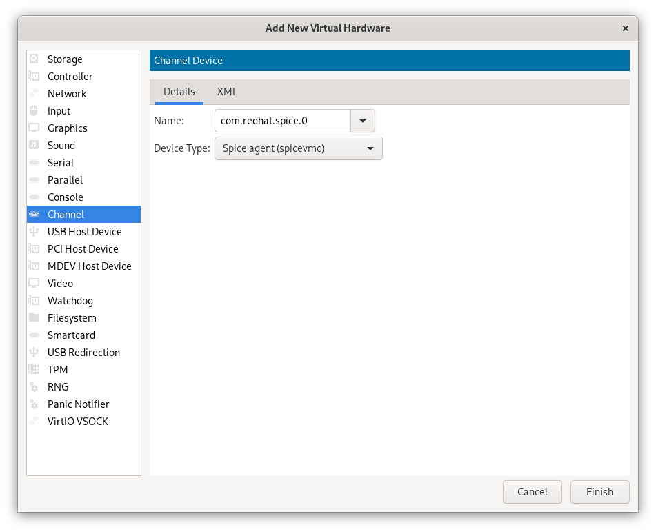

# Clipboard Sharing between Host and Guest

This guide will walk you through the process of enabling clipboard sharing between your host system and a virtual machine (VM) using the Spice agent.

## Spice and Clipboard Sharing

The Spice (Simple Protocol for Independent Computing Environments) providing features such as high-quality multimedia playback, audio support, and, importantly, clipboard sharing. enabling clipboard sharing, you can copy and paste text or files between your host and VM.

### Enabling Clipboard Sharing

Follow these steps to enable clipboard sharing between your host and VM using Virt-Manager:

1. **Start Your Virt-Manager:** Launch the Virt-Manager application and start your desired virtual machine.
2. **Add Spice Channel Device:** In the VM settings window, navigate to the `Add Hardware` section and select `Channel Spice.`
3. **Configure Spice Channel:** Provide the following details for the Spice channel device:

   - **Device:** Spice agent (spicevmc)
   - **Device Type:** com.redhat.spice.0

4. **Click Finish:** Click the `Finish` button to add the Spice channel device to your VM.

6. **Start the VM:** The Spice agent will now be active. try starting the VM and test the clipboard sharing feature.
