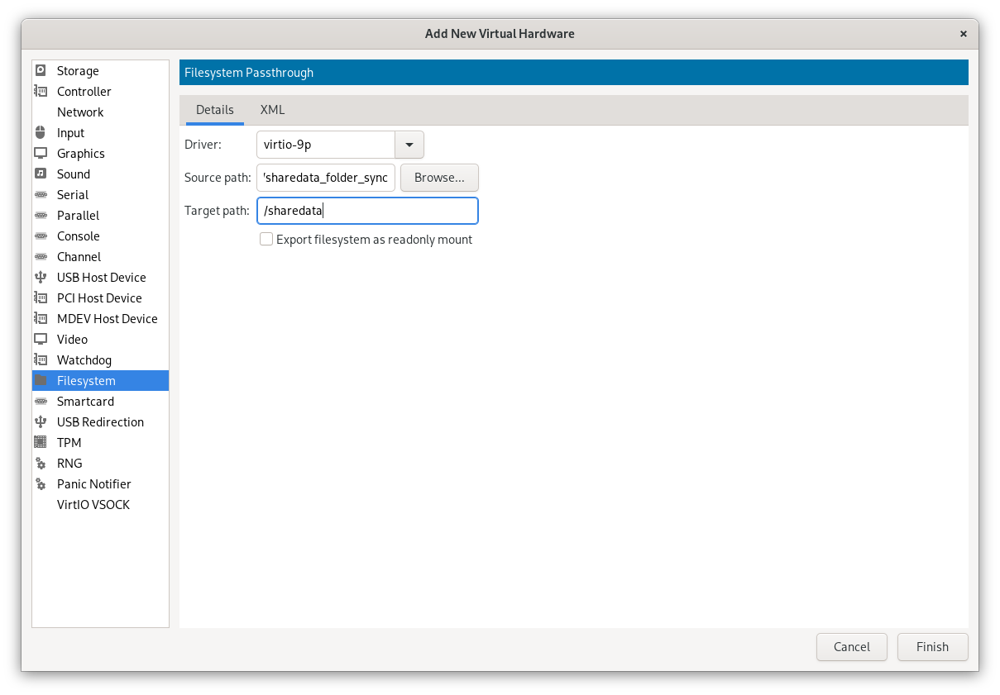

# Share Directory Between GNU/Linux Guest and GNU/Linux Host

This section will guide you on how to share a directory between a GNU/Linux guest and a GNU/Linux host using virt-manager. Enable the smoothly file sharing between the host and guest virtual machines. So you don't need to trubleshoot the network connection or install additional software to share files between the host and guest virtual machines. like cloud storage, lan sharing or bluetooth sharing.

## Prerequisites

Before proceeding, you should already have a virtual machine set up. This guide will not cover the process of creating a virtual machine.

## Step 1: Adding Filesystem Hardware

1. Open the settings for your GNU/Linux virtual machine in virt-manager.
2. Inside the settings, select `Add new Hardware.`
3. Choose `Filesystem` as the hardware type; this is what we will use for file sharing.
4. Configure the following options:
    - `Driver`: Select `virtio-9p.`
    - `Source path`: Choose the directory containing the files you want to share.
    - `Target path`: This is the mount point you can name as you prefer. you also need to enter this name in vm.
5. Once you've configured these settings, click `Finish` to add the new hardware.



## Step 2: Creating a Shared Directory in Your Virtual Machine

Before you can access shared files in your virtual machine, you need to create a directory to serve as the mount point. Here's how to do it:

1. Boot up your virtual machine.
2. Open a terminal in your virtual machine.
3. Create a directory called `shared` (you can choose a different name if you prefer):

```shell
mkdir shared
```

## Step 3: Mounting the Shared Folder

With the shared directory created in your virtual machine, you can now mount the shared folder using the following command:

```shell
sudo mount -t 9p -o trans=virtio /sharedata shared
```

This command mounts the specified mount point `/sharedata` to the share directory named `shared` within your virtual machine. The `-t 9p` option indicates that it's a virtio-9p filesystem.

To verify that the shared folder is mounted correctly, you can use the `lsblk` command:

```shell
lsblk
```

You should see the shared folder listed in the output.

## Step 4: Automating the Mount Process

To speed up the process of mounting the shared folder, you can automate it by adding an entry to your `fstab` file. So you don't need to mount the shared folder manually every time you boot up your virtual machine.

### fstab Configuration

In GNU/Linux, mounting configurations are managed through the `fstab` file.

```shell
sudo vim /etc/fstab
```

Add the following line to auto-mount the shared folder:

```shell
/sharedata          /home/<username>/shared     9p      trans=virtio,version=9p2000.L,rw        0 0
```

Replace `<username>` with your actual username. Save and exit the file.

### Final Step: Reboot Your System

Now, reboot your system, and you should see the `/sharedata` folder automatically mounted on your system.

## References

- [QEMU/KVM - Virt-Manager | Folder sharing and USB Redirection](https://onion.tube/watch?v=crDuKm6XNv4)
- [Virt-Manager Tips and Tricks from a VM Junkie](https://onion.tube/watch?v=9FBhcOnCxM8)
