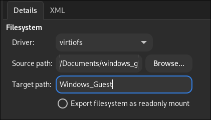
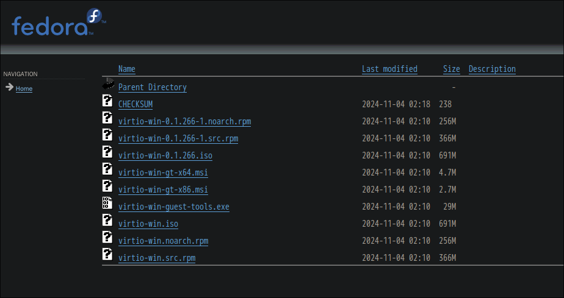
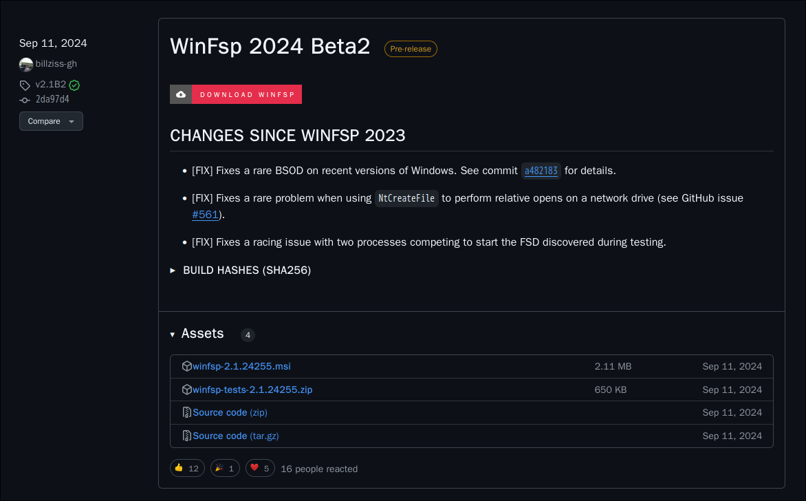
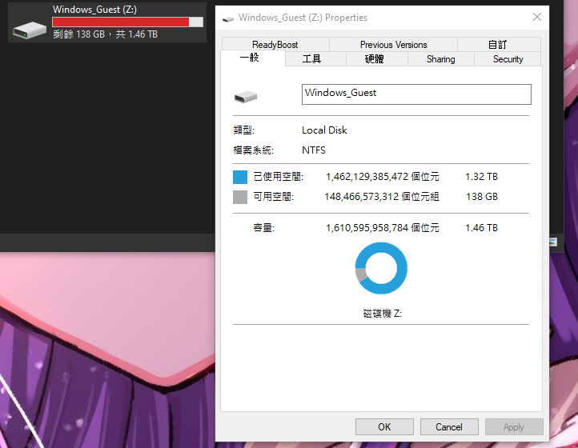

# Share Directory Between Windows Guest and GNU/Linux Host

In this section, we'll cover how to share a directory between your Windows guest and GNU/Linux host. This is useful for transferring files between the two operating systems.

## Why Share a Directory?

Before we begin, let's discuss why you might want to share a directory between your Windows guest and GNU/Linux host. Here are a few reasons:

- You want to transfer files between the two operating systems.
- You need to share a directory for a specific application or project.
- You want to access files from your GNU/Linux host in your Windows guest.
- You want to access files from your Windows guest in your GNU/Linux host.
- Using online cloud storage can be too troublesome.
- LAN sharing can also be complicated.

There are many ways to share files, such as using LocalSend, KDE Connect, or cloud storage services like Mega, Proton Drive, or Nextcloud. However, these methods often involve multiple steps: uploading the file and then downloading it again. This can be cumbersome. That's why sharing a directory is a more efficient solution.

## Prerequisites

I assume you have already set up your Windows guest and GNU/Linux host, and completed the basic setup for virt-manager and QEMU. If you haven't, please refer to the previous sections.

### Step 1: Enable Shared Memory

In your Windows guest, you need to enable shared memory. This is essential for sharing a directory between your Windows guest and GNU/Linux host.

1. Open the `virt-manager` application.
2. Select your Windows guest.
3. Go to `Memory` and select `Enable shared memory`.

### Step 2: Create a Filesystem

Next, you need to create a filesystem for your Windows guest. This filesystem will be used to share a directory between your Windows guest and GNU/Linux host.

1. Click `Add Hardware`.
2. Find `Filesystem`.
3. For the `Driver`, select `virtiofs`.
4. For the `Source Path`, select the directory you want to share. (you might need to create a directory from host first)
5. For the `Target Path`, type a name for the directory as it will appear in your Windows guest. This will become the drive name in the Windows guest.

### Step 3: Install Virtio Drivers

You need to install the Virtio drivers on your Windows guest. These drivers are essential for sharing a directory between your Windows guest and GNU/Linux host.

If you have followed the previous section, you should already have the Virtio drivers installed. If not, you can download them from the link below. Scroll down to the bottom of the page and choose the latest version of the Virtio drivers. from `2025-01-02`, the latest version is `virtio-win-0.1.266-1`. Download the `virtio-win-guest-tools.exe` file.

[Download Virtio Drivers](https://fedorapeople.org/groups/virt/virtio-win/direct-downloads/archive-virtio)

### Step 4: Install WinFsp

Next, you need to install WinFsp on your Windows guest. WinFsp is a Windows File System Proxy that allows you to mount a directory as a drive letter. You can download WinFsp from the link below.

From the GitHub repository's release section, choose the latest version of WinFsp and download and install the `winfsp-<version>.msi` file.

[Download WinFsp](https://github.com/winfsp/winfsp/releases/)

### Step 5: Reboot Windows Guest

After installing the Virtio drivers and WinFsp, you need to reboot your Windows guest. Since both the WinFsp and Virtio drivers are kernel-level drivers, a reboot is necessary to apply the changes.

> **IMPORTANT**: Please reboot your Windows guest after installing the Virtio drivers and WinFsp.

### Step 6: Start the Service

After rebooting your Windows guest, search for `Services` in the Windows search bar and open the `Services` application. Find the `VirtIO-FS Service`, enable it, and start the service.

### Final Step: Check the Drive

Finally, check the drive in your Windows guest. Open `File Explorer`, and you should see the drive you created in the `This PC` section.

For me, it appears as the `Z:` drive. The name of the drive is based on the `Target Path` you specified when creating the filesystem.

