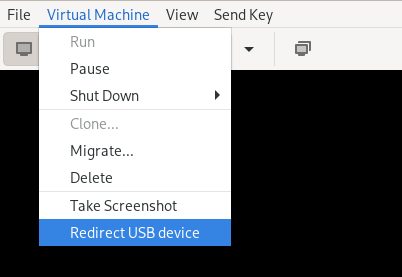

# Redirect USB Devices Real-Time with Passthrough

This guide will show you how to redirect your USB devices to your virtual machine in real-time without the need for USB passthrough. This feature is incredibly convenient, allowing you to use your USB devices dynamically, just as you would with a physical machine. you can also connect and disconnect your USB devices from your virtual machine every time as your need.

## Moronic approach

In the early days of using Virt-Manager, I used to keep my USB devices connected to the host machine for an extended period, thinking that they had to remain plugged in for the virtual machine to access them. However, this approach had its drawbacks. When I no longer needed the USB device on the host and decided to unplug it, I encountered an issue. If I started the virtual machine without the USB device connected, it would throw an error, as the VM expected the USB device to be available.

This situation was far from ideal. I wanted the flexibility to use USB devices with my virtual machines just as I would with a physical machine, plugging them in when needed and disconnecting them when done. Luckily, Virt-Manager offers a built-in solution for this exact scenario. Here's how you can easily redirect your USB devices without USB passthrough:

## Step 1: Access VM top menu

1. First, launch your virtual machine in Virt-Manager as you normally would.
2. In the top menu bar, click on `Virtual Machine.` A dropdown menu will appear. Then select `Redirect USB Device.` This action will prompt a new window to appear, listing all the USB devices connected to your host machine.

## Step 3: Select USB Devices

Now, you'll see a list of available USB devices. Each device will have a checkbox next to it. Simply click on the checkbox next to the USB device you want to redirect into your virtual machine.

>**IMPORTANT:** Again, this is passthrough-based, so please make sure that the USB device is not being used by the host machine. If the USB device is in use, you will not be able to redirect it to your virtual machine.

## Step 4: Apply and Use

Once you've selected the desired USB device(s), click the `Close` button to close this windows. Now Virt-Manager will now redirect the chosen USB device(s) to your virtual machine.

### Is USB Working?

This function is effective immediately, you can enter `lsusb` command to check whether it has been effective or not.

