## Setting Up Your Virtual Machine (Windows 10) – The Final Steps

Well done! You’re almost there. The last crucial steps for setting up your Windows 10 virtual machine.

### 1. Launch virt-manager and Create a New VM

Open up `virt-manager` and start by creating a new virtual machine.

### 1.2 Select Your Windows 10 ISO

Choose your Windows 10 ISO file.

### 1.3 Choose Your RAM

Decide on the amount of RAM you want to allocate to your VM.

### 1.4 Set Disk Image Size

Set the size of your virtual machine’s disk. Make sure to check `Enable storage for this virtual machine.`

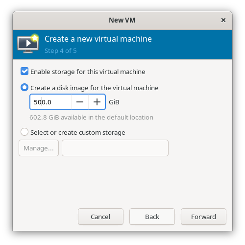

### 1.5 Configure VM Settings

Give your virtual machine a name and tick the box to `Customize configuration before install.`

### 1.6 Select Firmware

Choose `OVMF_CODE.fd` for firmware.

>**IMPORTANT**: This setting cannot be changed after you begin the installation, so double-check this choice.

### 1.7 Set Boot Options

Enable the boot menu. Select `SATA CDROM 1` and ensure it is checked. Set it as the first boot device to make sure it detects your Windows 10 installation ISO.

### 1.8 Add VirtIO Disk

After installing Windows, add a VirtIO Disk. we'll use for later.

### 1.9 Add VirtIO ISO

add the VirtIO ISO. This will be essential for smooth operation once Windows is installed.

### 1.9.1 Confirm Boot Options

Verify that your boot options look like the example below.

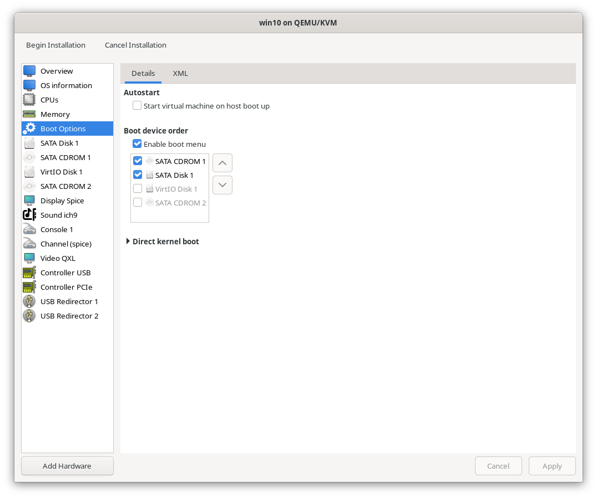

## 2. Begin Installation

Click the `Begin Installation` button to start the process.

## 3. Boot Your System

When prompted, press any key to boot from your CD/DVD.

### 3.2 Exit the UEFI Shell

If you get stuck in the UEFI Shell, type `exit` and press Enter to move forward.

### 3.3 Select Boot Manager

Use the arrow keys to navigate to and select `Boot Manager`.

### 3.4 Select Boot Manager (DVD)

Choose the first option to boot from the DVD.

### 3.5 Press Any Key Again

Press any key to continue booting up your system.

## 4. Windows Setup

Now you’ll see the Windows setup process start. The installation steps are similar to a regular Windows installation. Keep clicking `Next` until you reach the `Install Windows` option.

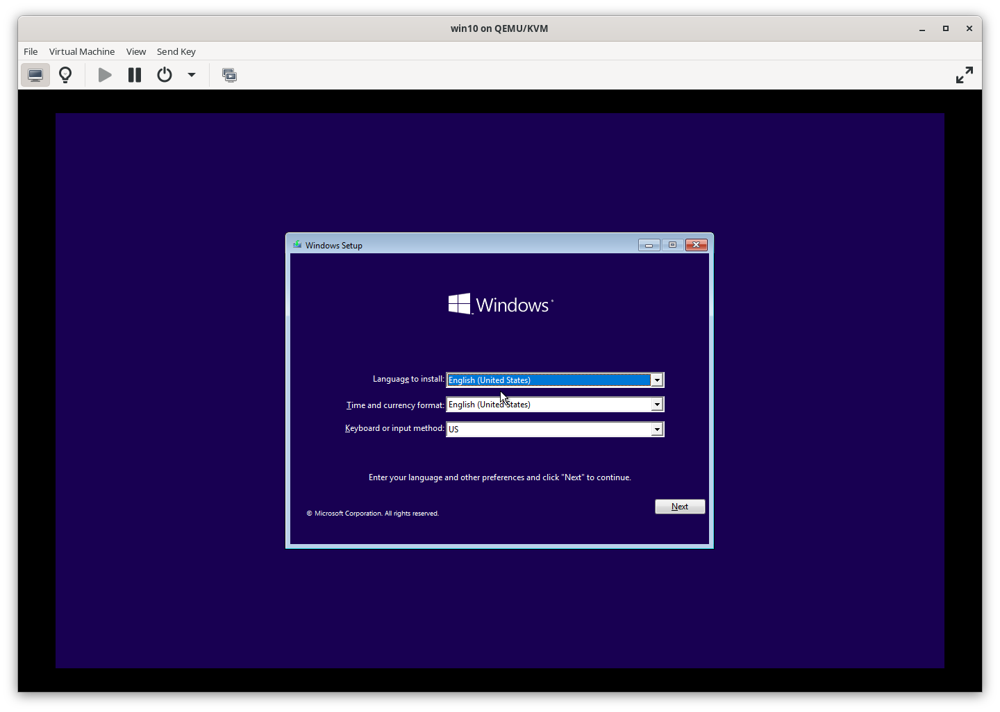

### 4.2 Install Now

Click `Install now`.

### 4.3 Skip Product Key

Click `I don’t have a product key`.

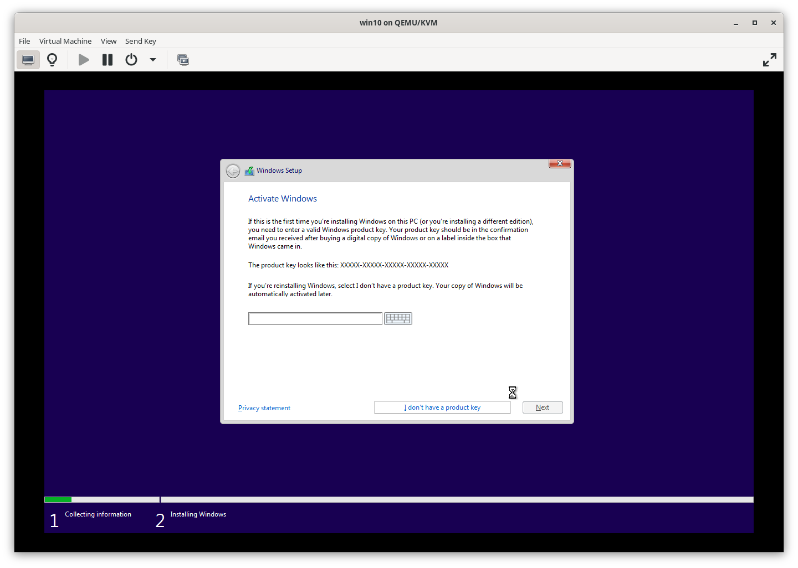

### 4.4 Select Version

Choose the Pro version of Windows. The Pro version supports offline accounts.

### 4.5 Accept License Terms

Tick the box to accept the license terms.

### 4.6 Custom Installation

Select `Custom` installation.

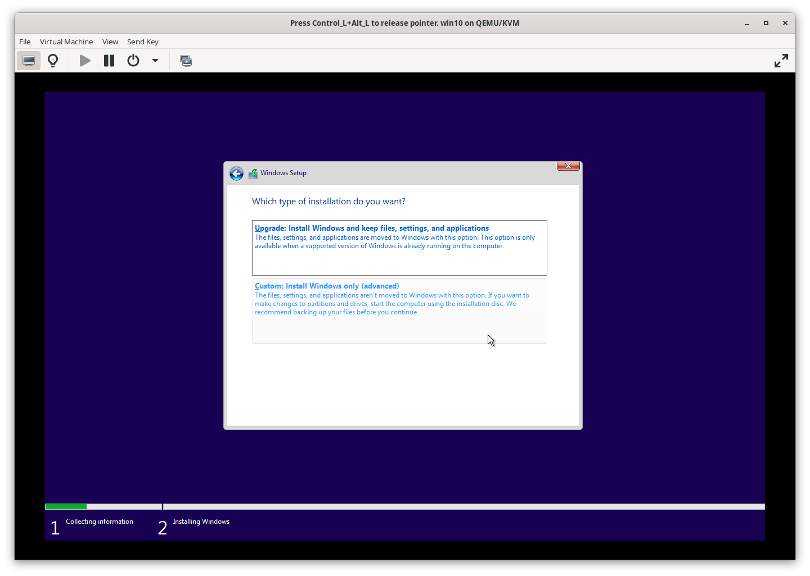

### 4.7 Load Drivers

Click `Load drivers`.

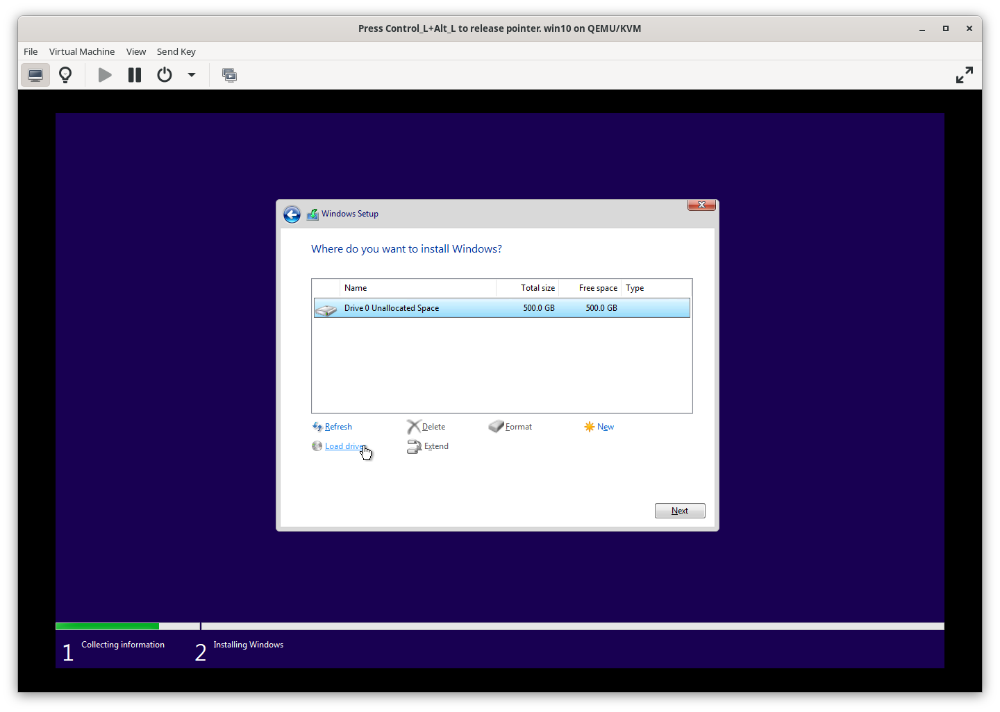

### 4.8 Browse for Drivers

Click `Browse`.

### 4.9 Select Virtio-Win

Choose the path `E:\amd64\w10` and click `OK`.

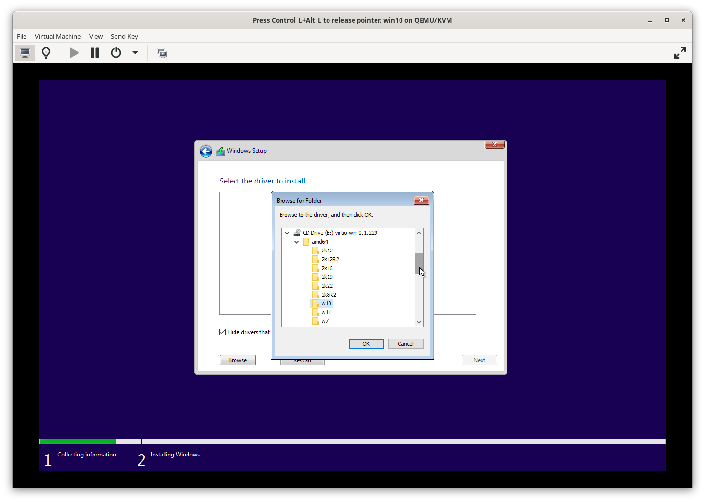

### 4.9.1 Red Hat VirtIO SCSI Controller

Select `Red Hat VirtIO SCSI controller` and click `Next`.

### 4.9.2 VirtIO Disk

You should see the new VirtIO Disk. This disk is crucial for installing new drivers later, so do not delete it.

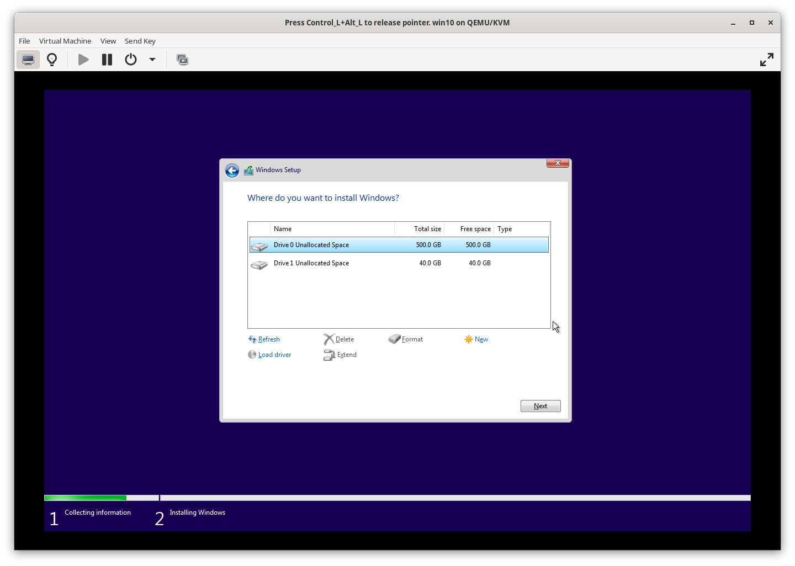

### 4.9.3 Select Installation Disk

Choose your disk for installing Windows. You can partition it into drives (e.g., 150 GB and 350 GB) as needed.

## 4.9.4 Installing Windows

Click to start the installation. This process will take some time.

### 4.9.5 Windows Configuration

Follow the prompts to complete the Windows setup. You can customize settings or proceed with defaults.

### 4.9.6 Power Off

Once the setup is complete, power off your VM.

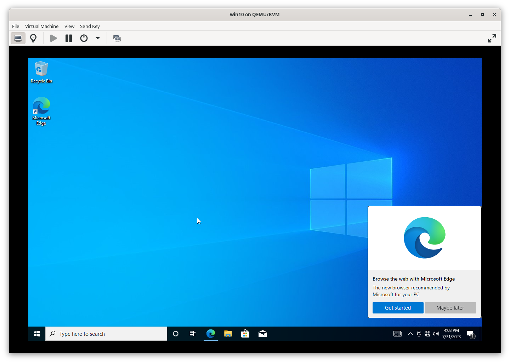

## 5. Remove ISO from virt-manager

You no longer need the Windows ISO file, so go ahead and remove it from `virt-manager`.

## 6. Add PCI Devices

Back to virt-manger and your virtual machine, add your PCI devices such as GPU, GPU-Audio, and Network, and power on the VM.

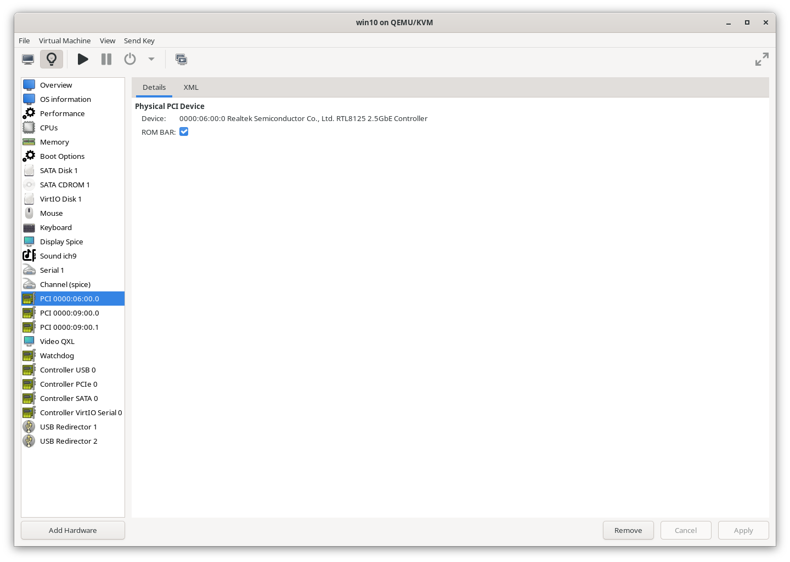

Once added, power on your VM.

## 7. Update Your VM

Ensure your system is up-to-date by connecting to the network and running Windows Update.

Windows updates can be slow, so be patient lmfao.

### 7.2 Update Drivers

To update your drivers, open Device Manager, find your PCI device, right-click, and select `Update Driver`.

1. Open Device Manager:
   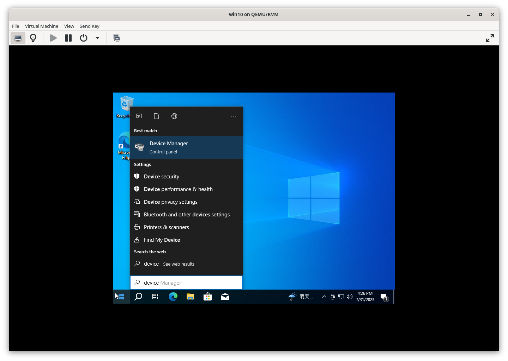

2. Right-click on your PCI device and choose `Update Driver`:
   

3. Select `Browse my computer for drivers`:
   

4. Browse to the path where your drivers are located (typically `E:\` or the path where you stored your VirtIO drivers) and click `Next`:
   

You should see your GPU listed in Device Manager, indicating that it’s correctly passthroughed.

### 7.3 Install VirtIO Drivers

To improve your VM’s performance, you need to install VirtIO drivers. Follow these steps:

1. Open File Explorer and navigate to the `E:\` drive where your VirtIO drivers are located.

   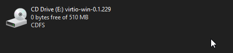

2. Find the file `virtio-win-gt-x64.msi` and double-click to start the installation.

   

3. Click `Next` to continue with the installation.

   

4. Accept the license agreement and click `Next`.

   

5. Continue clicking `Next` to proceed through the installation steps.

   

6. You might be prompted for superuser permissions. Click `Next` to grant the necessary permissions.

   

7. Wait for the installation to complete.

   

## 8. Configure Display Settings

For optimal performance, use a physical monitor instead of a virtual one. Ensure your second monitor displays your Windows 10 VM.

If not displayed, back to your vm and check that the GPU is enabled? if not enabled, on device section right-click to enable the GPU.

### 8.2 Passthrough USB and Mouse

To ensure smooth mouse and keyboard input, passthrough these devices to your VM.

>So that's why you might need two mice and a keyboard lol.

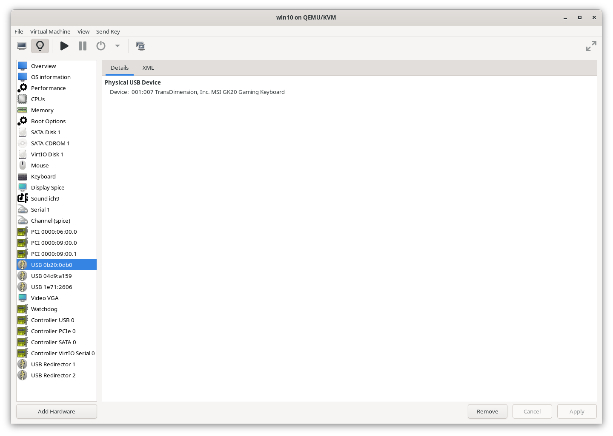

### 8.3 Optimize CPU Configuration

For better performance, configure your VM to use physical CPU cores instead of vCPUs.

## 9. Disable Automatic Suspend

Back to your GNU/Linux, To prevent your VM from being interrupted by idle timeouts, disable the `When idle` Automatic Suspend setting.

## Conclusion: You’re All Set!

Congratulations on setting up your virtual machine with hardware passthrough! You should now be able to use your second monitor and enjoy your VM for various tasks, including gaming.

If you run into any graphics issues, make sure to download and install the latest drivers for your GPU from:

- [AMD Support](https://www.amd.com/en/support)
- [NVIDIA Driver Downloads](https://www.nvidia.com/download/index.aspx)
